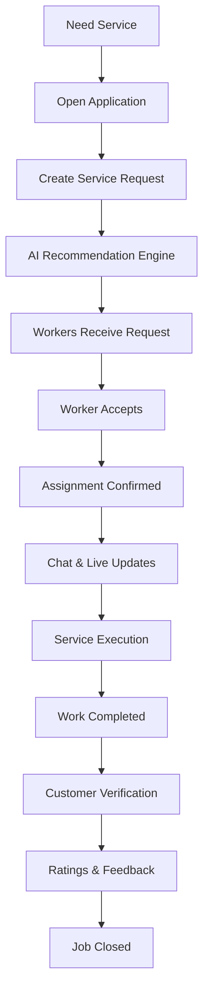

# Product Requirements Document (PRD)

## Introduction

Sahayak is a real-time AI-powered service marketplace that connects customers with trusted and skilled professionals for household and local services.

The platform aims to reduce the time required to discover reliable workers while ensuring skilled professionals receive fair and relevant work opportunities.

By intelligently understanding customer intent, geographical proximity, worker reputation, and real-time availability, Sahayak delivers faster and more accurate recommendations than traditional keyword-based service marketplaces.

---

# Problem Statement

Current service marketplaces and local discovery methods suffer from several limitations:

- Workers are frequently matched using exact keyword searches instead of understanding customer intent.
- Customers often struggle to identify trustworthy and qualified professionals.
- Finding nearby skilled workers can be time-consuming.
- New or highly capable workers receive fewer opportunities because existing platforms repeatedly recommend already popular workers.
- Communication between customers and workers is often delayed and fragmented.
- Customers receive limited visibility into worker availability and job progress.
- Existing recommendation systems rarely consider contextual information such as proximity, availability, reputation, and user intent together.

---

# Product Goals

The primary goals of Sahayak are:

- Connect customers with suitable professionals within **60 seconds** of creating a service request.
- Deliver intelligent recommendations based on semantic understanding rather than exact keyword matching.
- Provide workers with fair and relevant job opportunities.
- Enable seamless real-time communication throughout the service lifecycle.
- Build a reliable platform capable of supporting large-scale concurrent users.
- Increase customer trust through transparent ratings, reviews, and worker verification.

---

# Stakeholders

## Primary Stakeholders

- Customer
- Worker
- Administrator

## Secondary Stakeholders

- Customer Support Team
- Business Operations
- Engineering Team
- Platform Operations Team

---

# User Personas

## Customer

### Goals

- Find trusted professionals quickly.
- Receive accurate recommendations.
- Track job progress in real time.
- Communicate seamlessly with workers.

### Pain Points

- Difficulty identifying trustworthy workers.
- Slow responses.
- Poor recommendations.
- Lack of transparency during service.

### Success Criteria

- Finds an appropriate worker quickly.
- Receives high-quality service.
- Experiences a smooth booking process.

---

## Worker

### Goals

- Receive more relevant job opportunities.
- Gain fair visibility on the platform.
- Accept jobs quickly.
- Build professional reputation.

### Pain Points

- Same workers repeatedly receive opportunities.
- Irrelevant recommendations.
- Delayed notifications.
- Difficulty building reputation as a new worker.

### Success Criteria

- Receives relevant work consistently.
- Improves visibility through quality work.
- Experiences a fair recommendation process.

---

## Administrator

### Goals

- Monitor platform activity.
- Prevent fraudulent users and jobs.
- Resolve disputes.
- Analyze platform performance.
- Maintain overall marketplace health.

---

# Core User Journey

---

# Product Scope

## Included

- User Authentication
- Worker Discovery
- AI-based Matching
- Real-time Notifications
- Live Chat
- Worker Ratings & Reviews
- Worker Availability
- Job Tracking
- Admin Dashboard

## Out of Scope (MVP)

- Online Payments
- Video Calling
- Subscription Plans
- Dynamic Pricing
- AI Voice Assistant
- Multi-city Deployment
- Offline Mode
- Multi-language Support

---

# Success Metrics

## Business KPIs

| Metric | Target |
|----------|---------|
| Average Worker Acceptance Time | < 60 sec |
| Job Completion Rate | > 90% |
| Recommendation Acceptance Rate | > 70% |
| Customer Satisfaction | > 4.5 / 5 |
| Worker Retention | > 80% |

---

## Engineering KPIs

| Metric | Target |
|----------|---------|
| Matching Latency | < 2 sec |
| Notification Delivery | < 2 sec |
| API Response Time (P95) | < 200 ms |
| Chat Delivery Latency | < 100 ms |
| Duplicate Job Assignments | 0 |
| Concurrent Users Supported | 100,000+ |

---

# Assumptions

- Every worker owns a smartphone.
- Workers grant GPS permissions while available for work.
- Workers maintain internet connectivity while accepting jobs.
- Customers provide sufficient information about requested services.
- One worker can actively perform only one job at a time.
- Jobs require only a single assigned worker in the MVP.

---

# Constraints

- MVP targets deployment within a single city.
- Platform must remain responsive under high concurrent usage.
- Recommendation quality should not significantly degrade under peak traffic.
- Personally identifiable information (PII) must be securely protected.
- Platform should tolerate temporary failures of individual services without complete system downtime.

---

# Risks

- Low worker density may reduce recommendation quality.
- GPS inaccuracies may affect proximity-based recommendations.
- Poor internet connectivity may delay notifications and real-time communication.
- Ambiguous customer requests may reduce semantic matching accuracy.
- Fraudulent ratings may impact recommendation quality if not monitored.

---

# Product Success Statement

Sahayak succeeds when a customer can request a service and quickly connect with the most suitable professional, while workers receive fair and meaningful opportunities in a marketplace that remains reliable, responsive, transparent, and scalable as it grows.