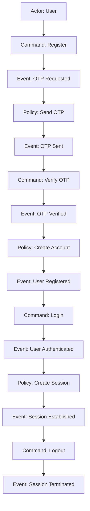
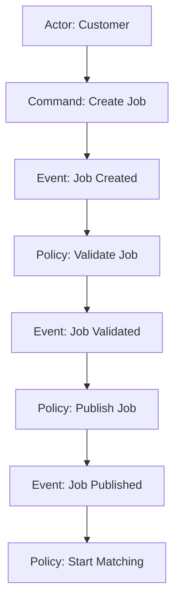
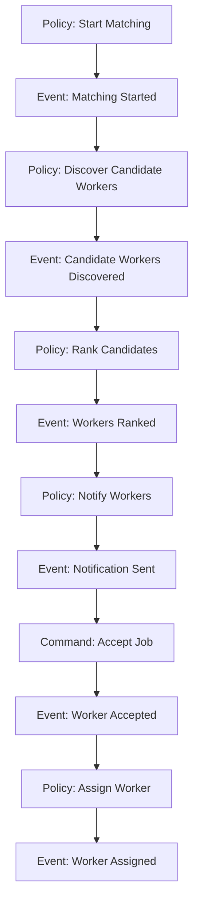
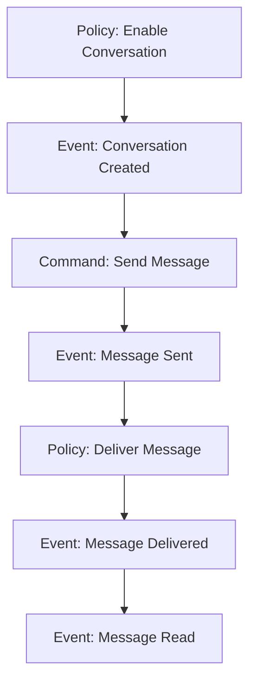
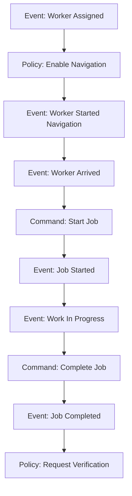
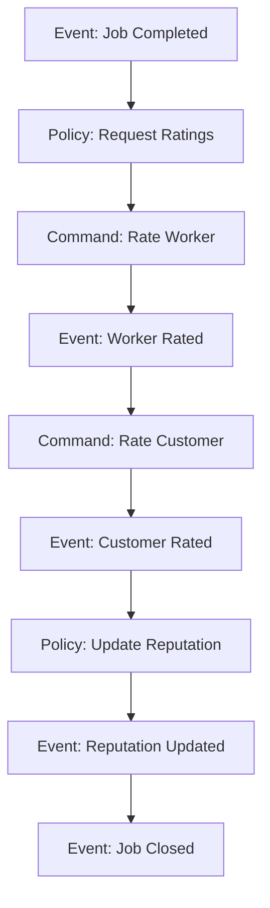
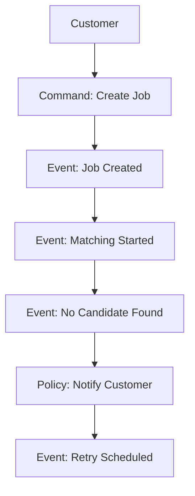
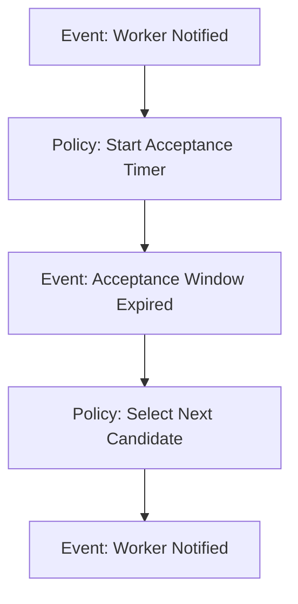
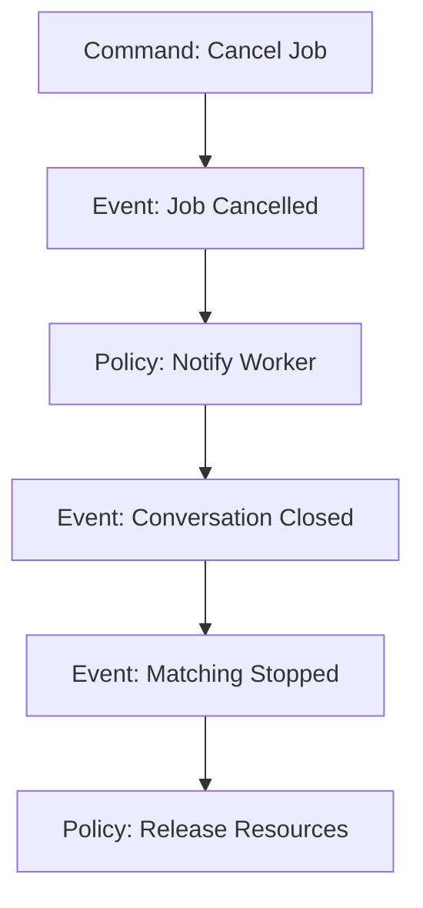

# Event Storming

## Purpose

This document models the complete business lifecycle of Sahayak using business events.

The objective is to understand how the business behaves before designing APIs, databases, services, or distributed architecture.

Every event represents an immutable business fact that has already occurred.

---

# Event Naming Convention

Events must:

- Be written in past tense.
- Represent completed business facts.
- Be independent of implementation.
- Never describe APIs, databases, or technologies.

Examples

User Registered

Job Created

Worker Assigned

---

# Business Domains

The platform consists of the following business domains:

1. Authentication
2. User Management
3. Job Management
4. Matching Engine
5. Communication
6. Job Execution
7. Feedback & Reputation
8. Administration

---

# Workflow

## Authentication

---

## Job Management

---

## Matching Engine

---

## Communication

---

## Job Execution

---

## Feedback

---

## Failure Workflow - No Worker Found

---

## Failure Workflow - Worker Timeout

---

## Failure Workflow - Customer Cancels

---
